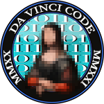

# dvCTF 2021

Source code and exploits/writeups of some of the challenges.

## List of challenges
- Web
  - [Homework](./web/homework/) 
  - [Authentication](./web/authentication/) 
  - [Obfuscation](./web/obfuscation/) 
  - [Lightweiight](./web/ldap_injection/) 
  - [Members](./web/members/) 
  - [High security](./web/high_security/) 
- Forensics
  - [Post office](./forensics/post_office/) 
  - [Art gallery](./forensics/art_gallery/) 
- Crypto
  - [Flipping tables](./crypto/flipping_tables/)
  - [Z340 but not really](./crypto/z340/)
  - [the more, the less](./crypto/the_more_the_less/)
  - [Bootless RSA](./crypto/bootless_rsa/)
- pwn
  - [Kanagawa](./pwn/kanagawa/) 
  - [Format me](./pwn/format_me/) 
  - [Quotebook](./pwn/quotebook/) 
- Reverse
  - [Rocca Pia](./reverse/rocca_pia/) 
  - [Crackme](./reverse/crackme/) 
  - [Cryptex](./reverse/cryptex/) 
- Stega
  - [Pidieff](./stega/pidieff/) 
  - [Read](./stega/read/) 
  - [Da Vinci vs Pacioli](./stega/da_vinci_vs_pacioli/) 
- OSINT
  - [Janus](./osint/janus/) 
  - [All aboard](./osint/all_aboard/) 
- Scripting
  - [디지털 코드](./prog/korean_digipad/) 
  - [Numbers](./prog/numbers/) 

## Useful links if you want to organize your own CTF
- [2019 challenges of the France Cybersecurity Challenge (with Dockerfiles)](https://github.com/ANSSI-FR/ctf)
- [How to host a CTF?](https://security.christmas/2020/18)
- [Self-hosting a CTF platform](https://medium.com/csictf/self-hosting-a-ctf-platform-ctfd-90f3f1611587)

## Flag format
dvCTF{printable_ASCII_chars}
