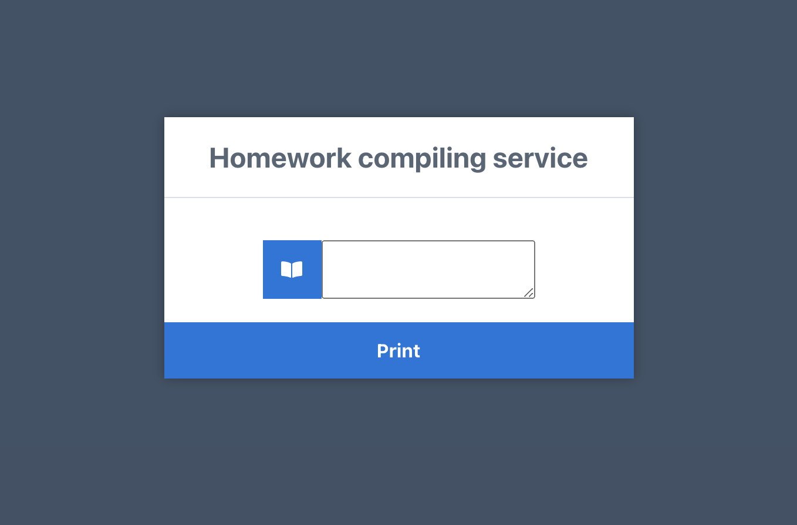
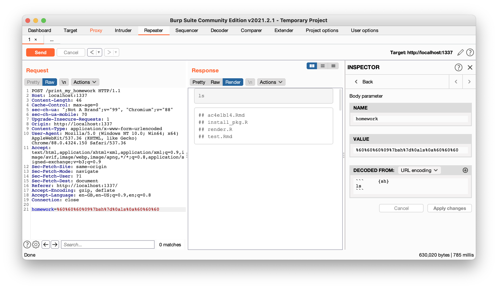

# Homework

Chrome and Firefox don't like the 6666 port, so we can create a reverse-proxy to redirect port 6666 to our local port 1337.

```sh
cd reverse_proxy
docker-compose up --detach
```

Now we can go on http://localhost:1337 and we see a 'Homework compiling service'. 



Testing some input (e.g. $1+1=2$) we see that it's an R-Markdown compiler, with some filtering for the code execution. This can be seen because \`\`\`{sh} returns the same result as \`\`\`. If you download RStudio and compile an example Rmd file, you will see that any whitespace between the \`\`\` and {sh} part will be discarded. In this challenge, spaces are filtered but tabs are not. In order to add a tab, we will need to intercept the request using Burp.



We see a flag file when executing `ls ../` and `cat ../flag` gives us the flag.

## Unintended solves

You could also solve it by doing a LFI with this payload:

```

